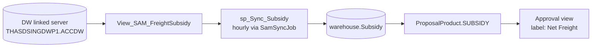
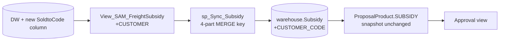

# CR#1 — Freight Subsidy / Net Freight Correction

---

## Meta

| Field | Value |
|---|---|
| CR ID | CR#1 |
| Title | Freight Subsidy / Net Freight Correction |
| Status | Draft — awaiting customer confirmation |
| Module | Proposal (Type R / S / P) + Approval views |
| Owner | K. North (data owner, DW side) |
| Sponsor | TBD |
| Created | 2026-05-21 |
| Target Release | TBD |
| Priority | High |
| Source | Customer change request (verbal) — K. North verified DW data |

---

## Revision History

| Ver | Date | Author | Change |
|---|---|---|---|
| 0.1 | 2026-05-21 | — | Initial draft (HTML) |
| 0.2 | 2026-05-22 | — | Ported to markdown template |

---

## Contents

1. [Requirement](#1-requirement)
2. [Current State](#2-current-state)
3. [Target State](#3-target-state)
4. [Assumptions](#4-assumptions)
5. [Out of Scope](#5-out-of-scope)
6. [Dependencies](#6-dependencies)
7. [Impact Analysis](#7-impact-analysis)
8. [Risks & Mitigation](#8-risks--mitigation)
9. [Proposed Solution](#9-proposed-solution)
10. [Rollout / Cutover Plan](#10-rollout--cutover-plan)
11. [Rollback Strategy](#11-rollback-strategy)
12. [Monitoring & Telemetry](#12-monitoring--telemetry)
13. [Security / Compliance](#13-security--compliance)
14. [Estimate](#14-estimate)
15. [Success Metrics](#15-success-metrics)
16. [Acceptance Criteria](#16-acceptance-criteria)
17. [Open Questions](#17-open-questions)
18. [Sign-off](#18-sign-off)
19. [References](#19-references)
20. [Glossary](#20-glossary)

---

## 1. Requirement

เปลี่ยน source ของ Net Freight data — การคำนวณต้องอิงจาก **Org / Customer / Material** (จากเดิม Org / Material).
ใช้ data ที่ K. North verify แล้วใน DW.

---

## 2. Current State

**Pipeline:**



**Key facts:**
- **Current key:** `PERIOD + ORGNO + PRODUCT_CODE` (3 fields, ไม่มี Customer)
- **Snapshot model:** `SUBSIDY` ถูก copy เข้า `ProposalProduct` ตอน create — proposal เก่าไม่กระทบเมื่อ data source เปลี่ยน
- **Display label:** "Net Freight" แต่ value field = `freightSubsidy`

**Code references** (commit TBD — pin SHA before approval):
- `Sql/PamDB/Store-view/sp_Sync_warehouse.sql` — `sp_Sync_Subsidy`
- `Features/ProposalDetails/CreateCommand/CreateProposalProductDiscountRebate.cs` lines 33, 55
- `Features/ProposalDetails/CreateCommand/CreateProposalProductProject.cs` lines 34, 57
- `Features/ProposalDetails/CreateCommand/CreateProposalProductRebateAmount.cs` lines 30, 53
- `Features/Sync/SamSyncService.cs` line 26

---

## 3. Target State

**Pipeline (unchanged shape, wider key):**



- Net Freight ดึงจาก DW โดยใช้ key `Org + Customer + Material` (4-part composite)
- K. North = data owner ฝั่ง DW
- Snapshot semantics ใน `ProposalProduct` คงเดิม (historical proposal ปลอดภัย)

---

## 4. Assumptions

- A1: K. North สามารถเพิ่ม `SoldtoCode` ใน `View_SAM_FreightSubsidy` ได้ภายใน sprint
- A2: Customer code ใน DW (SoldtoCode) match กับ `Customer.SoldtoCode` ใน SAM โดยตรง ไม่ต้อง mapping table
- A3: Historical `warehouse.Subsidy` rows ทั้งหมดสามารถ backfill `CUSTOMER_CODE = '*'` (wildcard) ได้โดยไม่กระทบ reporting
- A4: Existing hourly sync window พอเพียง — ไม่ต้อง real-time
- A5: Snapshot semantics ปัจจุบันถูกต้องตาม business — pending proposal ไม่ recalculate ก่อน approve

---

## 5. Out of Scope

- Recalculate / backfill historical proposals (snapshot ใน `ProposalProduct` ไม่เปลี่ยน)
- Real-time DW query (ใช้ scheduled sync เดิม)
- Rebate calculation logic เปลี่ยน (เฉพาะ Net Freight source เท่านั้น)
- SAP sync payload format เปลี่ยน
- Report / Export format เปลี่ยน (อาจ verify เท่านั้น)
- Type S / P deep refactor — verify reference เท่านั้น

---

## 6. Dependencies

| # | Depends On | Owner | ETA | Blocking? |
|---|---|---|---|---|
| D1 | DW view `View_SAM_FreightSubsidy` เพิ่ม `SoldtoCode` column | K. North + DW team | TBD | **Yes (blocker)** |
| D2 | DW staging environment สำหรับ SIT | DW team | TBD | Yes |
| D3 | Customer code mapping clarification (SoldtoCode vs KUNNR) | K. North | TBD | Yes |
| D4 | Linked server `THASDSINGDWP1.ACCDW` credential update (ถ้าจำเป็น) | DBA | TBD | No |

---

## 7. Impact Analysis

### 7.1 External Systems (DW)

| Item | Change |
|---|---|
| `View_SAM_FreightSubsidy` | เพิ่ม column `SoldtoCode` (Customer Code) |
| Granularity | `Period+Org+Product` → `Period+Org+Customer+Product` |

### 7.2 Backend

| File | Change |
|---|---|
| `Entities/Subsidy.cs` | เพิ่ม field `CUSTOMER_CODE` |
| `Sql/PamDB/Store-view/sp_Sync_warehouse.sql` (`sp_Sync_Subsidy`) | เพิ่ม customer ใน SELECT / MERGE key / hash / index |
| EF migration ใหม่ | `AddCustomerToSubsidy` — column + PK + index |
| `Sql/PamDB/Seed-init/subsidy.sql` | update seed |
| `Features/ProposalDetails/CreateCommand/CreateProposalProductDiscountRebate.cs:33,55` | `OUTER APPLY` เพิ่ม `s2.CUSTOMER_CODE = @SoldtoCode` |
| `Features/ProposalDetails/CreateCommand/CreateProposalProductProject.cs:34,57` | เพิ่ม customer filter |
| `Features/ProposalDetails/CreateCommand/CreateProposalProductRebateAmount.cs:30,53` | เพิ่ม customer filter |
| `CreateProposalDetailCommandHandler.cs` | ส่ง `@SoldtoCode` เข้า query |
| `Features/Sync/SamSyncService.cs:26` | unchanged (เรียก SP เดิม) |
| Approval read views (Sam/Sdm × Type R/S/P, 6 files) | อ่าน snapshot — unchanged |
| `SamApp.WebApi.Tests/...` | update entity test + เพิ่ม customer lookup unit test |
| `docs/specs/job-sync-master-data.spec.md` | update granularity |

### 7.3 Frontend

กระทบ Type R เป็นหลัก (label "Net Freight" → value `freightSubsidy`). มี ref ใน Type S/P → ต้อง verify.

| Area | Files |
|---|---|
| Request Type R — Rebate form/table | `RebateForm.tsx`, `RebateTableCard.tsx`, `RebateWrapper.tsx` |
| Request Type R — Summary | `SummaryWrapper.tsx`, `summary-rebate.mapper.tsx` |
| Request Type R — Schema/Mapper | `rebate.schema.ts`, `rebate.types.ts`, `rebate.apply.ts`, `rebate.util.ts`, `rebate-multipage.ts` |
| Approval Type R — Detail | `ViewRebateInformation.tsx` (label "Net Freight") |
| Approval — Lists/Mapper/Types | `lists/all/index.tsx`, `approval.mapper.ts`, `rebate-info.types.ts`, `approval-overview-r/s/p.ts` |
| Constants | `rebate-columns.ts` |
| Shared | `components/rebate/RebateTable.tsx` |
| Markups (storybook) | `__markups__/R/...` (4 files) |

**FE file count:** 24 files.

### 7.4 Database / Migration

| Object | Change | Backfill |
|---|---|---|
| `warehouse.Subsidy.CUSTOMER_CODE` | New column `nvarchar(64) NULL` | Existing rows → `'*'` (wildcard) |
| PK / Unique index | Add `CUSTOMER_CODE` to composite key | N/A |
| `IX_Subsidy_Key` | New non-clustered index `(PERIOD, ORGNO, CUSTOMER_CODE, PRODUCT_CODE)` | N/A |

### 7.5 Operations / Infra

- Hangfire job `SamSyncJob` — schedule unchanged (hourly)
- Linked server credential — verify unchanged
- DW network ACL — verify customer column accessible

**File count summary:** BE = ~11, FE = 24, SQL/migration = 2.

---

## 8. Risks & Mitigation

| # | Risk | Likelihood | Impact | Severity | Mitigation | Owner |
|---|---|---|---|---|---|---|
| R1 | DW view ยังไม่มี Customer column | High | High | **Blocker** | ประสาน K. North / DW team ก่อนเริ่ม | PM |
| R2 | Historical Subsidy data ไม่มี Customer — recalc ย้อนหลังไม่ได้ | High | Med | High | Snapshot ปลอดภัย — เผยแพร่ communication ว่าข้อมูลย้อนหลังไม่เปลี่ยน | BA |
| R3 | Composite key เปลี่ยน → migrate `warehouse.Subsidy` | Med | Med | Med | Backfill `CUSTOMER_CODE='*'` + reseed plan | DBA |
| R4 | Customer code mapping SAM ↔ DW (SoldtoCode vs KUNNR) | Med | High | High | Verify schema กับ K. North + sample compare | BE |
| R5 | Fallback เมื่อ Org+Cust+Prod ไม่เจอ row | Med | Med | Med | กำหนด policy ชัด (wildcard / 0 / error) — default `ISNULL(...,0)` | BE |
| R6 | Performance — index ใหม่ + row count ใหญ่ขึ้น | Low | Med | Low | Bench query plan + monitor p95 | DBA |
| R7 | DW downtime กระทบ proposal creation | High | High | **High** | Cache last-known-good + alert + fallback wildcard | BE |
| R8 | Audit — number เปลี่ยน user งง | Med | Med | Med | Parallel-run + comm to sales team | PM |

---

## 9. Proposed Solution

### Approach

ใช้ infrastructure เดิม (linked server + `sp_Sync_Subsidy` + `warehouse.Subsidy`) — ขยาย schema เพิ่ม Customer dimension. ไม่สร้าง pipeline ใหม่.

### Steps

1. **DW team** เพิ่ม column `SoldtoCode` ใน `View_SAM_FreightSubsidy`
2. **Schema migration:**

   ```sql
   ALTER TABLE warehouse.Subsidy ADD CUSTOMER_CODE nvarchar(64) NULL;
   UPDATE warehouse.Subsidy SET CUSTOMER_CODE = '*' WHERE CUSTOMER_CODE IS NULL;
   ALTER TABLE warehouse.Subsidy ALTER COLUMN CUSTOMER_CODE nvarchar(64) NOT NULL;
   CREATE INDEX IX_Subsidy_Key
     ON warehouse.Subsidy (PERIOD, ORGNO, CUSTOMER_CODE, PRODUCT_CODE);
   ```

3. **Update `sp_Sync_Subsidy`** — เพิ่ม Customer ใน SELECT, MERGE key, hash
4. **Update Proposal queries (3 files):**

   ```sql
   WHERE s2.ORGNO         = @SaleOrgCode
     AND s2.PRODUCT_CODE  = @ProductCode
     AND s2.CUSTOMER_CODE = @SoldtoCode
   ```

5. **Fallback strategy** — exact match ไม่เจอ → fallback `(Org+Product)` wildcard `CUSTOMER_CODE='*'` → log warning
6. **Snapshot semantics ไม่เปลี่ยน** — proposal เก่าใช้ value ที่ save ไว้
7. **Sync model** — scheduled (เดิม hourly) — fast read, decoupled, ทน DW down

### Alternatives considered

| Option | Pros | Cons | Decision |
|---|---|---|---|
| Real-time DW query | Fresh data | DW latency + tight coupling, DW down = SAM down | **Reject** |
| New separate cache table | Isolated schema | Duplicate sync pipeline | **Reject** |
| Extend existing pipeline | Reuse infra, minimal risk | Migration required | **Accept** |

---

## 10. Rollout / Cutover Plan

| # | Step | Owner | When | Verify |
|---|---|---|---|---|
| 1 | DW deploy new view column | DW team | T-7d | Schema check |
| 2 | DB migration on staging | DBA | T-5d | Row count + index |
| 3 | Deploy BE with feature flag off | BE | T-3d | Smoke test |
| 4 | Enable flag in staging | BE | T-2d | Parallel-run compare |
| 5 | Production migration | DBA | T-0 (low traffic) | Backfill verify |
| 6 | Enable flag in prod | BE | T-0 | Spot check 10 proposals |
| 7 | Parallel-run period | All | T+0 to T+7d | Daily reconciliation |
| 8 | Disable old code path | BE | T+14d | None — code removed next sprint |

- Feature flag: `feat.netFreight.customerKey` (default off → on at cutover)
- Parallel-run window: 7 days
- Cutover date / time: TBD (low-traffic window, e.g. weekend)
- Maintenance window: ~30 min for migration

---

## 11. Rollback Strategy

| Trigger | Action | Recoverable? |
|---|---|---|
| Sync ล้มเหลวหลัง migration | Disable feature flag → revert to wildcard lookup | Yes |
| Data corruption ใน `warehouse.Subsidy` | Restore จาก pre-migration backup + re-sync | Yes |
| Production query errors | Toggle flag off (BE code falls back to 3-part key) | Yes |
| DW view roll-back | DW team revert + SAM disable flag | Yes |

- DB rollback script: `Sql/PamDB/Rollback/cr1-revert.sql` (TBD)
- Pre-migration backup: `warehouse.Subsidy_pre_cr1` table, retain 30 days
- Feature flag kill-switch: **Yes** — flips synchronously, no redeploy

---

## 12. Monitoring & Telemetry

| Metric | Source | Threshold | Alert |
|---|---|---|---|
| `sp_Sync_Subsidy` runtime | Hangfire dashboard | > 5 min | Slack #sam-ops |
| Sync lag (last successful sync) | Custom metric | > 2 h | Email + Slack |
| Fallback hit rate (wildcard match) | App log counter | > 20% | Daily report |
| Query p95 latency (Subsidy lookup) | Application Insights | > baseline + 10% | Slack |
| Proposal create error rate | App log | > 1% | Pager |

- New dashboard: Grafana `sam-netfreight-cr1` (TBD)
- New alerts: Slack channel `#sam-cr1-monitor`
- Log fields added: `subsidyMatchType` (exact / fallback / miss), `subsidyCustomerCode`

---

## 13. Security / Compliance

- **PII / sensitive data:** Customer code (SoldtoCode) — already in scope of existing system, no new exposure
- **Access control change:** None
- **Audit log:** Existing proposal audit captures snapshot value — no extra requirement
- **Compliance regime:** PDPA — verify customer code retention policy unchanged
- **Security review:** Not required (no auth / authz / data-exposure change)

---

## 14. Estimate

### 14.1 Backend

| Task | Role | Effort | Confidence |
|---|---|---|---|
| Investigation DW schema + access setup | BE | 1 d | ±20% |
| Design data model (staging + mapping) | BE | 0.5 d | ±20% |
| EF migration + entity | BE | 0.5 d | ±10% |
| DW connection / credential | DBA | 0.5 d | ±30% |
| Update `sp_Sync_Subsidy` | BE / DBA | 1.5 d | ±20% |
| Hangfire job / sync verify | BE | 0.5 d | ±10% |
| Net Freight query rewrite (3 files) | BE | 1 d | ±10% |
| Fallback / cache strategy | BE | 0.5 d | ±30% |
| Unit tests | BE | 1 d | ±20% |
| Integration test กับ DW staging | BE | 1 d | ±30% |
| Code review fix | BE | 0.5 d | ±30% |
| Bug fix buffer | BE | 1 d | ±50% |
| **BE total** | | **~9.5 d** | |

### 14.2 Frontend

| Task | Role | Effort | Confidence |
|---|---|---|---|
| Update DTO / TS types (rebate, approval-overview-r/s/p) | FE | 0.5 d | ±10% |
| Update mapper (rebate.apply, summary-rebate, approval.mapper) | FE | 1 d | ±20% |
| Display — RebateTable, RebateForm, ViewRebateInformation | FE | 1 d | ±20% |
| Summary view (SummaryWrapper) | FE | 0.5 d | ±20% |
| Loading / error / tooltip state | FE | 0.5 d | ±30% |
| Verify Type S/P references | FE | 0.3 d | ±30% |
| Component test | FE | 0.5 d | ±20% |
| Regression Type R full flow | FE | 1 d | ±30% |
| Code review fix | FE | 0.5 d | ±30% |
| Bug fix buffer | FE | 0.7 d | ±50% |
| **FE total** | | **~6.5 d** | |

### 14.3 Code Review

| Task | Role | Effort |
|---|---|---|
| BE PR review | Tech Lead | 0.5 d |
| FE PR review | Tech Lead | 0.5 d |
| Cross-team review (DW integration) | DBA + BE | 0.5 d |
| **Review total** | | **~1.5 d** |

### 14.4 QA

| Task | Role | Effort |
|---|---|---|
| Test plan + scenario | QA | 1 d |
| Test data prep (DW staging + edge) | QA | 1 d |
| Functional — happy path | QA | 1 d |
| Edge case — missing/mismatch/DW down | QA | 1.5 d |
| Regression — Proposal, Rebate, SAP sync, Report | QA | 2 d |
| Parallel run (old vs new source) | QA | 1 d |
| Bug retest cycles | QA | 1.5 d |
| **QA total** | | **~9 d** |

### 14.5 SIT

| Task | Role | Effort |
|---|---|---|
| SIT env setup + DW staging hookup | DevOps | 1 d |
| Smoke test (SAM ↔ DW) | QA | 0.5 d |
| E2E (proposal create → rebate calc → SAP sync) | QA | 1.5 d |
| Data reconciliation (SAM vs DW) | QA / BE | 1 d |
| Performance (sync latency, query response) | QA / DBA | 0.5 d |
| Failover (DW down → fallback) | QA / BE | 0.5 d |
| Bug fix support | BE / FE | 1 d |
| SIT sign-off + report | QA Lead | 0.5 d |
| **SIT total** | | **~6 d** |

### 14.6 UAT support

| Task | Role | Effort |
|---|---|---|
| UAT prep + walkthrough | BA / Dev | 0.5 d |
| UAT bug fix + retest | Dev | 1 d |
| **UAT total** | | **~1.5 d** |

### 14.7 Summary

| Phase | Effort |
|---|---|
| BE | 9.5 d |
| FE | 6.5 d |
| Code Review | 1.5 d |
| QA | 9 d |
| SIT | 6 d |
| UAT | 1.5 d |
| **Total man-days** | **~34 d** |
| **Calendar (parallel roles)** | **~5 weeks** |

> **Blockers / preconditions:** DW access + new view ready day 1 — else +1 week. SIT requires DW staging env — else +3 d.

---

## 15. Success Metrics

| Metric | Baseline | Target | Measure When |
|---|---|---|---|
| Net Freight accuracy (vs DW reconciliation) | TBD (current data) | 100% match on exact-key rows | T+7d after cutover |
| Fallback hit rate (wildcard match) | N/A | < 5% | T+30d |
| Sales-rep complaint count re. Net Freight | TBD (baseline last 30d) | < baseline | T+60d |
| Sync job runtime | ~{TBD} s | ≤ baseline + 10% | T+7d |
| Proposal create error rate | ~{TBD}% | ≤ baseline | T+7d |

---

## 16. Acceptance Criteria

### Backend

- [ ] AC-BE-1: `warehouse.Subsidy` has column `CUSTOMER_CODE` — TC-TBD
- [ ] AC-BE-2: `sp_Sync_Subsidy` MERGE uses 4-part key (Period+Org+Customer+Product) — TC-TBD
- [ ] AC-BE-3: Proposal create (Type R/S/P) retrieves Subsidy by customer correctly — TC-TBD
- [ ] AC-BE-4: Fallback behaviour deterministic (wildcard / zero / error per policy) — TC-TBD
- [ ] AC-BE-5: Unit test covers exact match + fallback + null — TC-TBD
- [ ] AC-BE-6: Integration test passes against DW staging view — TC-TBD
- [ ] AC-BE-7: Historical proposal snapshot in `ProposalProduct` unchanged — TC-TBD
- [ ] AC-BE-8: Query response < baseline + 10% — TC-TBD

### Frontend

- [ ] AC-FE-1: Label "Net Freight" displays value from new source on proposal page — TC-TBD
- [ ] AC-FE-2: Type R Rebate flow complete (form → summary → approval view) — TC-TBD
- [ ] AC-FE-3: Type S/P verified (used / not used decision documented) — TC-TBD
- [ ] AC-FE-4: Loading / error / fallback state handles DW down — TC-TBD
- [ ] AC-FE-5: Component tests + regression Type R pass — TC-TBD

### Data / Migration

- [ ] AC-DATA-1: All existing `warehouse.Subsidy` rows backfilled with `CUSTOMER_CODE='*'` — TC-TBD
- [ ] AC-DATA-2: Index `IX_Subsidy_Key` created — TC-TBD
- [ ] AC-DATA-3: Rollback script tested on staging — TC-TBD

---

## 17. Open Questions

| # | Category | Question | Owner | Due | Status |
|---|---|---|---|---|---|
| Q1 | Data | DW view ใหม่ ETA จาก K. North = ? | K. North | TBD | Open |
| Q2 | Data | Customer code ใน DW = `SoldtoCode` หรือ `KUNNR` (SAP)? Match กับ `Customer.SoldtoCode` ใน SAM ไหม | K. North | TBD | Open |
| Q3 | Data | มี doc / schema ของ view ที่ verify ไหม | K. North | TBD | Open |
| Q4 | Data | Refresh frequency ใน DW เอง = ? | DW team | TBD | Open |
| Q5 | Business | Fallback policy: exact (Org+Cust+Prod) ไม่เจอ → wildcard / zero / fail ? | BA | TBD | Open |
| Q6 | Business | Historical row เก่าใน `warehouse.Subsidy` → set `CUSTOMER_CODE='*'` หรือ delete + reseed ? | BA / DBA | TBD | Open |
| Q7 | Business | SUBSIDY ใน ProposalProduct ของ pending proposal — recalculate ก่อน approve ไหม ? | BA | TBD | Open |
| Q8 | Business | Cutover date = วันไหน | PM | TBD | Open |
| Q9 | Business | Parallel run period ต้องการนานแค่ไหน | BA | TBD | Open |
| Q10 | Business | กระทบ Rebate calculation ด้วยไหม | BA | TBD | Open |
| Q11 | Business | SAP sync payload เปลี่ยนไหม | BE | TBD | Open |
| Q12 | Ops | DW down → SAM behavior ? (block / cached / continue with warning) | BE / Ops | TBD | Open |
| Q13 | Ops | Alert channel ถ้า sync ล้มเหลว | Ops | TBD | Open |
| Q14 | Ops | Production cutover — pause sync, migrate, resume — downtime tolerance ? | Ops | TBD | Open |
| Q15 | UX | Label เดิม "Net Freight" หรือเปลี่ยน "Net Freight (Org+Cust+Material)" | UX / BA | TBD | Open |
| Q16 | UX | Tooltip แสดง source = DW + last sync time ไหม | UX | TBD | Open |
| Q17 | UX | Drilldown ต่อ Customer ไหม | UX | TBD | Open |
| Q18 | UX | Customer ยังไม่เลือก → ฟิลด์แสดงอะไร | UX | TBD | Open |
| Q19 | UX | User เปลี่ยน customer → refresh Net Freight อัตโนมัติไหม | UX / FE | TBD | Open |
| Q20 | UX | DW down → FE แจ้ง user หรือเงียบ | UX / FE | TBD | Open |
| Q21 | UX | User override ค่าได้ไหม | BA | TBD | Open |
| Q22 | UX | Type S/P ใช้ Net Freight ไหม (verify) | FE | TBD | Open |
| Q23 | UX | Subsidy = 0 (no match) → block submit หรือ warning | BA | TBD | Open |
| Q24 | UX | Permission — role ไหนเห็นบ้าง (srp/sam/sdm/pte/fin/cdr) | BA | TBD | Open |
| Q25 | UX | Localization — TH translation + tooltip wording | UX | TBD | Open |
| Q26 | UX | Report / Export — กระทบไหม | BA | TBD | Open |
| Q27 | UX | Markups (storybook) update ตาม design ใหม่ไหม | UX | TBD | Open |

---

## 18. Sign-off

| Role | Name | Decision | Date |
|---|---|---|---|
| Business Owner | TBD | Pending | — |
| Tech Lead | TBD | Pending | — |
| QA Lead | TBD | Pending | — |
| PM | TBD | Pending | — |
| Data Owner (DW) | K. North | Pending | — |

---

## 19. References

- Jira / ticket: TBD
- Confluence: TBD
- Figma / design: TBD
- Related PR(s): TBD
- DW / external doc: TBD
- Original HTML draft: `docs/CR1-net-freight.html`
- Template source: `docs/templates/CR-template.md`

---

## 20. Glossary

| Term (EN) | Term (TH) | Definition |
|---|---|---|
| Net Freight | ค่าขนส่งสุทธิ | ค่าขนส่งที่หักส่วนชดเชย — แสดงในหน้า approval / proposal |
| Freight Subsidy | ส่วนชดเชยค่าขนส่ง | ส่วนชดเชยที่บริษัทช่วยจ่ายให้ลูกค้า |
| SUBSIDY | — | Column ใน `ProposalProduct` ที่ snapshot ค่า subsidy ตอน create |
| DW | Data Warehouse | Linked server `THASDSINGDWP1.ACCDW` |
| SoldtoCode | รหัสลูกค้า (Sold-to) | รหัส customer ใน SAM, match กับ DW |
| KUNNR | — | SAP customer code (อาจต่างจาก SoldtoCode) |
| MERGE key | — | Composite key ที่ใช้ใน SQL MERGE statement สำหรับ upsert |
| Snapshot | — | ค่าที่ copy เข้า ProposalProduct ตอน create — ไม่เปลี่ยนตามเวลา |
| Org | Sales Organisation | รหัสองค์การขาย (ORGNO) |
