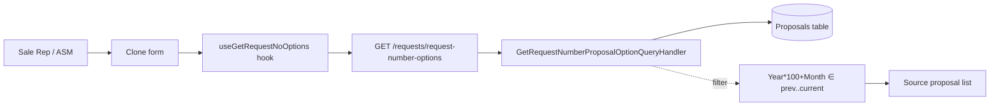
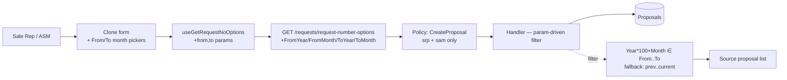

# CR#2 — Project Proposal Management (Clone old proposals)

---

## Meta

| Field | Value |
|---|---|
| CR ID | CR#2 |
| Title | Project Proposal Management — allow clone of proposals older than 1 month |
| Status | Draft |
| Module | Proposal — Clone source list (GetRequestNumberOptions) |
| Owner | TBD |
| Sponsor | TBD (Sales team) |
| Created | 2026-05-22 |
| Target Release | TBD |
| Priority | Medium |
| Source | Customer change request — `docs/CR1-9.txt` item #2 |

---

## Revision History

| Ver | Date | Author | Change |
|---|---|---|---|
| 0.1 | 2026-05-22 | — | Initial draft — scope locked to Clone only (Modify deferred, Terminate awaiting BA) |

---

## Contents

1. [Requirement](#1-requirement)
2. [Current State](#2-current-state)
3. [Target State](#3-target-state)
4. [Assumptions](#4-assumptions)
5. [Out of Scope](#5-out-of-scope)
6. [Dependencies](#6-dependencies)
7. [Impact Analysis](#7-impact-analysis)
8. [Risks & Mitigation](#8-risks--mitigation)
9. [Proposed Solution](#9-proposed-solution)
10. [Rollout / Cutover Plan](#10-rollout--cutover-plan)
11. [Rollback Strategy](#11-rollback-strategy)
12. [Monitoring & Telemetry](#12-monitoring--telemetry)
13. [Security / Compliance](#13-security--compliance)
14. [Estimate](#14-estimate)
15. [Success Metrics](#15-success-metrics)
16. [Acceptance Criteria](#16-acceptance-criteria)
17. [Open Questions](#17-open-questions)
18. [Sign-off](#18-sign-off)
19. [References](#19-references)
20. [Glossary](#20-glossary)

---

## 1. Requirement

อนุญาตให้ user **clone** proposal/project ที่มีอายุเกิน 1 เดือนได้ ปัจจุบันระบบจำกัด source ของการ clone ไว้เฉพาะ proposal ของเดือนปัจจุบันและเดือนก่อนหน้าเท่านั้น Sales team ต้องการ clone proposal เก่าเพื่อสร้าง proposal ใหม่ในเดือนปัจจุบัน/ถัดไป

**Original CR (verbatim):**
> Request to allow users to clone, modify, or terminate proposals/projects older than one month.
> Current system limitation only allows actions for the current and previous month.

**Scope decision (this CR):**
- ✅ **Clone** — implement in this CR
- ⏸️ **Modify** — deferred to future CR (separate ticket)
- ⏸️ **Terminate** — deferred, requires BA clarification (no "Terminate" concept in current code; only Delete for Draft)

---

## 2. Current State

**Flow:**

**Key facts:**
- Source filter hard-codes `prev month ≤ (Year*100+Month) ≤ current month`
- Filter applied **server-side** in `GetRequestNumberProposalOptionQueryHandler.cs:21-30`
- Endpoint uses `[Authorize]` only — no role policy
- Other filters preserved: `WhereApprovedByCommercialDirector`, `WhereCustomerGroupNotExpire`, SAP success rule, `SaleOrgCode`, `ProposalGroupId`, `CustomerGroupId`
- Clone **target** month restricted to current+next by `CreateProposalHandler.cs:27-33` — separate guard, unchanged by this CR
- Delete restricted to `Draft` status only — no age check
- `PatchGeneralInfo` allows year ±1 from today
- `WhereInPrevCurrNextMonthTh()` helper defined in `ProposalQueries.cs:8-28` but **never called**
- `CloseMonth` blocks Submit, not Clone — orthogonal concern

**Code references** (commit TBD — pin SHA before approval):
- `web/web/backend/SamApp.WebApi/Features/Proposal/GetRequestNumberOptions/GetRequestNumberProposalOptionQueryHandler.cs` lines 21-30 — filter
- `web/web/backend/SamApp.WebApi/Features/Proposal/GetRequestNumberOptions/GetRequestNumberProposalOptionEndpoint.cs` line 14 — auth
- `web/web/backend/SamApp.WebApi/Features/Proposal/GetRequestNumberOptions/GetRequestNumberOptionsQuery.cs` — query DTO
- `web/web/backend/SamApp.WebApi/Features/Proposal/GetRequestNumberOptions/GetRequestNumberOptionsQueryValidator.cs` — validator
- `web/web/frontend/src/features/request/hooks/index.ts` lines 126-160 — `useGetRequestNoOptions`
- `web/web/backend/SamApp.WebApi/Shared/Helpers/ProposalHelpers.cs` lines 37-45 — `IsCurrent()` helper

---

## 3. Target State

**Flow:**

**Targets:**
- Add optional `FromYear`, `FromMonth`, `ToYear`, `ToMonth` to query
- Handler uses supplied range; if null → fallback to current+prev (backward compat)
- Endpoint policy = existing `CreateProposal` (Sales Rep + Area Sales Manager)
- FE adds From/To month-year pickers; defaults From = current-1, To = current; user widens to clone older proposals
- All other handler filters unchanged (Approved by CD, customer group not expired, SAP success)

---

## 4. Assumptions

- A1: Existing `CreateProposal` policy roles (srp + sam) match CR requirement. Confirmed via investigation — policy defined in `Program.cs:163` (approx).
- A2: BA accepts that the source list may return many rows when range widened — UI uses standard dropdown with search; no server-side pagination needed.
- A3: `WhereApprovedByCommercialDirector` and `WhereCustomerGroupNotExpire` filters still apply to old proposals — i.e., user can only clone old proposals that were fully approved and whose customer group has not expired.
- A4: Cloning an old proposal creates a NEW proposal in current/next month (`CreateProposalHandler` rule unchanged). The old proposal acts as a template, not a copy with original month.
- A5: No DB migration needed — pure query parameter change.

---

## 5. Out of Scope

- Modify old proposals (`PatchGeneralInfo` guard untouched)
- Terminate old proposals — no "Terminate" action exists today; needs BA discovery
- Removing `CloseMonth` restriction on Submit
- Changing clone-target month rule in `CreateProposalHandler`
- Pagination of source dropdown
- Cloning across `SaleOrgCode` / `ProposalGroupId` / `CustomerGroupId` boundaries
- Audit logging beyond what already exists for proposal create

---

## 6. Dependencies

| # | Depends On | Owner | ETA | Blocking? |
|---|---|---|---|---|
| D1 | SAM Jira ticket # for branch naming | PM | TBD | Yes |
| D2 | BA confirmation on default From/To values (current spec: prev/current month) | BA | TBD | No — sane default already chosen |

---

## 7. Impact Analysis

### 7.1 External Systems (DW / SAP / 3rd party)

| Item | Change |
|---|---|
| DW | None |
| SAP | None |
| MinIO | None |

### 7.2 Backend

| File | Change |
|---|---|
| `Features/Proposal/GetRequestNumberOptions/GetRequestNumberOptionsQuery.cs` | Add `int? FromYear, int? FromMonth, int? ToYear, int? ToMonth` |
| `Features/Proposal/GetRequestNumberOptions/GetRequestNumberOptionsQueryValidator.cs` | Validate range cohesion (all 4 set or all null), From ≤ To, month 1-12 |
| `Features/Proposal/GetRequestNumberOptions/GetRequestNumberProposalOptionQueryHandler.cs` | Replace hardcoded month bounds with params; fallback to prev/current when null |
| `Features/Proposal/GetRequestNumberOptions/GetRequestNumberProposalOptionEndpoint.cs` | Replace `.RequireAuthorization()` with `.RequireAuthorization("CreateProposal")` |
| `SamApp.WebApi.Tests/Features/Proposal/GetRequestNumberOptions/...` | New xUnit cases (5 scenarios) |

### 7.3 Frontend

| Area | Files | Change |
|---|---|---|
| Hook | `features/request/hooks/index.ts` (`useGetRequestNoOptions`) | Accept `from?: {year,month}, to?: {year,month}`; pass to query |
| Clone form | TBD — component using `useGetRequestNoOptions` (locate during implementation) | Add From/To month-year pickers; default From = current-1, To = current; refetch on change |
| i18n labels | `lib/i18n/locales/*` | Add labels for "From month", "To month" (en + th) |

### 7.4 Database / Migration

| Object | Change | Backfill |
|---|---|---|
| — | None | — |

### 7.5 Operations / Infra

- None

**File count summary:** BE = 4 (+ tests), FE = 2-3, SQL/migration = 0.

---

## 8. Risks & Mitigation

| # | Risk | Likelihood | Impact | Severity | Mitigation | Owner |
|---|---|---|---|---|---|---|
| R1 | Widened range returns huge source list → dropdown lag | Med | Low | Low | FE: default narrow (prev/current); user opt-in to widen. Add search filter on dropdown if not already present. | FE-dev |
| R2 | Cloning very old proposal with stale product/pricing data → invalid new proposal | Med | Med | Med | Existing `CreateProposal` pipeline already validates products/pricing at create time. Reject invalid clones with clear error. | BE-dev |
| R3 | Role policy change accidentally blocks current callers | Low | High | Med | `CreateProposal` policy = srp+sam; verify no other role currently uses clone source endpoint (grep FE callers — only 1 hook). | BE-dev |
| R4 | Cloning approved old proposal whose `CustomerGroup` later expired → `WhereCustomerGroupNotExpire` excludes it silently | Med | Low | Low | Document in user guide. Not a code change — existing filter behavior. | BA |
| R5 | Backward compat break — handler signature change affects unknown caller | Low | Med | Low | Make all 4 range params nullable; null = today's behavior. Only 1 FE consumer found. | BE-dev |
| R6 | Validator misconfigured — partial range (e.g. From set, To null) reaches handler | Low | Med | Low | Validator rejects partial range. Add xUnit case. | BE-dev |

> No High × High items.

---

## 9. Proposed Solution

### Approach

Param-driven filter. Add optional `From*`/`To*` to query; handler picks `(supplied range) ?? (prev/current default)`. Endpoint reuses existing `CreateProposal` policy for role gating. FE adds two month-year pickers above the source dropdown with sane default (last 2 months) so existing users see no change.

### Steps

1. BE: extend `GetRequestNumberOptionsQuery` with 4 nullable int params.
2. BE: extend validator with cohesion + range checks.
3. BE: rewrite handler month-bound logic — param-or-default.
4. BE: swap endpoint authorization to `"CreateProposal"` policy.
5. BE: add xUnit cases — in-range, out-of-range, no-range default, invalid range 400, role 403.
6. FE: extend `useGetRequestNoOptions` signature with `from`/`to` and wire to query string.
7. FE: locate clone form component; add From/To month-year pickers (Radix UI + Tailwind). Default From = current-1, To = current.
8. FE: i18n labels (en + th).
9. Manual QA: verify clone flow end-to-end with old proposal as source.
10. Code review (`code-reviewer` agent) → merge → release.

### Alternatives considered

| Option | Pros | Cons | Decision |
|---|---|---|---|
| Remove filter entirely (no params) | Simplest BE diff | Breaks UX — huge dropdown; no user control over range | Reject |
| Add preset dropdown (1mo/3mo/6mo/All) | Simpler UX | Less precise; doesn't match BA preference | Reject |
| Server-side pagination on source list | Scales | Big FE rework; not requested | Reject — defer |
| Reuse `WhereInPrevCurrNextMonthTh()` helper | Already defined | Hardcoded ±1 month — doesn't satisfy "older than 1 month" | Reject |
| Param-driven range with default fallback (chosen) | Backward compatible; precise; small diff | Validator must enforce cohesion | **Accept** |

---

## 10. Rollout / Cutover Plan

| # | Step | Owner | When | Verify |
|---|---|---|---|---|
| 1 | Merge feature branch to `develop` | Dev | T-0 | Build green; unit tests pass |
| 2 | Deploy to DEV environment | DevOps | T+0 | Manual smoke — clone old proposal via FE |
| 3 | UAT on UAT env | BA + Sales user | T+1d | UAT acceptance criteria signed |
| 4 | Deploy to PROD | DevOps | next release window | Smoke — clone source dropdown loads with default range |

- Feature flag: **not used** (small, low-risk, backward-compatible change)
- Parallel-run window: N/A
- Maintenance window required: No

---

## 11. Rollback Strategy

| Trigger | Action | Recoverable? |
|---|---|---|
| Source dropdown broken / 500 | Revert PR commit; redeploy previous build | Yes |
| Role policy blocks valid users | Hotfix — revert endpoint `.RequireAuthorization("CreateProposal")` to `.RequireAuthorization()` | Yes |
| FE date pickers misbehave | Revert FE PR; BE param fallback keeps endpoint usable | Yes |

- DB rollback script: none (no migration)
- Snapshot / backup: standard daily DB backup
- Feature flag kill-switch: No (no flag)

---

## 12. Monitoring & Telemetry

| Metric | Source | Threshold | Alert |
|---|---|---|---|
| `/requests/request-number-options` p95 latency | App logs / Serilog | < 500 ms | Slack #sam-alerts if > 1 s |
| 4xx rate on endpoint | App logs | < 1% | Slack if spike post-deploy |
| 403 rate on endpoint | App logs | baseline | Investigate if non-zero — may indicate role misconfig |

- New dashboards: none (use existing API latency dashboard)
- New alerts: none
- Log fields added: existing request logging captures query params automatically

---

## 13. Security / Compliance

- PII / sensitive data touched: No (proposal metadata only — same scope as today)
- Access control change: **Yes** — endpoint moves from `[Authorize]` (any auth'd user) to `CreateProposal` policy (srp + sam only)
- Audit log requirement: existing proposal-create audit trail already covers downstream clone action
- Compliance regime: none
- Security review required: No — defense-in-depth tightening, no new exposure

---

## 14. Estimate

> Effort in man-days. Confidence `±%` reflects uncertainty.

### 14.1 Backend

| Task | Role | Effort | Confidence |
|---|---|---|---|
| Extend query DTO + validator | BE-dev | 0.5 d | ±10% |
| Rewrite handler filter logic | BE-dev | 0.5 d | ±10% |
| Swap endpoint authorization policy | BE-dev | 0.25 d | ±5% |
| xUnit tests (5 scenarios) | BE-dev | 1 d | ±20% |
| **BE total** | | **~2.25 d** | |

### 14.2 Frontend

| Task | Role | Effort | Confidence |
|---|---|---|---|
| Extend `useGetRequestNoOptions` hook | FE-dev | 0.5 d | ±10% |
| Locate clone form + add From/To pickers | FE-dev | 1.5 d | ±30% (component location unknown) |
| i18n labels (en + th) | FE-dev | 0.25 d | ±10% |
| Manual QA in DEV | FE-dev | 0.5 d | ±20% |
| **FE total** | | **~2.75 d** | |

### 14.3 Code Review

| Task | Role | Effort |
|---|---|---|
| BE + FE diff review | Reviewer | 0.5 d |
| **Review total** | | **~0.5 d** |

### 14.4 QA

| Task | Role | Effort |
|---|---|---|
| Test scenarios + execution | QA | 1 d |
| **QA total** | | **~1 d** |

### 14.5 SIT

| Task | Role | Effort |
|---|---|---|
| SIT execution + bug fix loop | QA / Dev | 0.5 d |
| **SIT total** | | **~0.5 d** |

### 14.6 UAT support

| Task | Role | Effort |
|---|---|---|
| UAT support + clarifications | Dev / BA | 0.5 d |
| **UAT total** | | **~0.5 d** |

### 14.7 Summary

| Phase | Effort |
|---|---|
| BE | 2.25 d |
| FE | 2.75 d |
| Code Review | 0.5 d |
| QA | 1 d |
| SIT | 0.5 d |
| UAT | 0.5 d |
| **Total man-days** | **~7.5 d** |
| **Calendar (parallel BE/FE)** | **~1 week** |

> Blockers / preconditions: SAM Jira ticket #; BA confirmation on default range values.

---

## 15. Success Metrics

| Metric | Baseline | Target | Measure When |
|---|---|---|---|
| % of new proposals created via clone from >1mo old source | ~0% (blocked today) | ≥10% within 1 month post-release | 30 days post-release |
| User-reported "cannot clone old proposal" tickets | TBD (count last quarter) | 0 | 60 days post-release |
| Source dropdown p95 latency | current baseline | no regression > 100 ms | week 1 post-release |

---

## 16. Acceptance Criteria

### Backend

- [ ] AC-BE-1: GET `/requests/request-number-options` with `FromYear=2024&FromMonth=1&ToYear=2024&ToMonth=12` returns proposals within that range — TC-BE-1
- [ ] AC-BE-2: GET without any `From*/To*` params returns proposals from current+prev month only (backward compat) — TC-BE-2
- [ ] AC-BE-3: GET with `FromYear=2024&FromMonth=6` (partial range) returns 400 with validator message — TC-BE-3
- [ ] AC-BE-4: GET with `From > To` returns 400 — TC-BE-4
- [ ] AC-BE-5: GET as user with role other than srp/sam returns 403 — TC-BE-5
- [ ] AC-BE-6: Approved old proposal whose customer group is expired is **not** returned (existing filter preserved) — TC-BE-6

### Frontend

- [ ] AC-FE-1: Clone form shows two month-year pickers labelled From / To, defaulting to current-1 / current — TC-FE-1
- [ ] AC-FE-2: Changing From/To pickers refetches source dropdown with new range — TC-FE-2
- [ ] AC-FE-3: Source dropdown populates with proposals from selected range — TC-FE-3
- [ ] AC-FE-4: User can complete clone flow end-to-end with an old proposal (>2 months) as source — TC-FE-4
- [ ] AC-FE-5: Labels render correctly in en + th — TC-FE-5

### Data / Migration

- [ ] AC-DATA-1: No DB schema change — verify migration list unchanged — TC-DATA-1

---

## 17. Open Questions

| # | Category | Question | Owner | Due | Status |
|---|---|---|---|---|---|
| Q1 | Business | Should "Terminate" be a separate CR? Define meaning (cancel approved? soft-delete? new status?) | BA | TBD | Open |
| Q2 | Business | Should "Modify" old proposals (PatchGeneralInfo) also be unlocked? Currently scoped out. | BA | TBD | Open |
| Q3 | UX | Max range allowed for From/To pickers? Cap at e.g. 2 years to bound result set? | UX / BA | TBD | Open |
| Q4 | Business | When user clones old proposal, should pricing/discount values be **recalculated** against current price list, or copied as-is then validated? | BA | TBD | Open |
| Q5 | Ops | Any audit requirement to log "cloned from old proposal" for compliance? | Compliance | TBD | Open |

---

## 18. Sign-off

| Role | Name | Decision | Date |
|---|---|---|---|
| Business Owner | TBD | Approve / Reject | TBD |
| Tech Lead | TBD | Approve / Reject | TBD |
| QA Lead | TBD | Approve / Reject | TBD |
| PM | TBD | Approve / Reject | TBD |

---

## 19. References

- Jira / ticket: TBD (SAM-XXX)
- Source CR list: `docs/CR1-9.txt` item #2
- Related CR: `docs/CR1-net-freight.md`
- Code (commit TBD):
  - `web/web/backend/SamApp.WebApi/Features/Proposal/GetRequestNumberOptions/`
  - `web/web/frontend/src/features/request/hooks/index.ts`
- Auth policy reference: `web/web/backend/SamApp.WebApi/Program.cs` — `CreateProposal` policy definition

---

## 20. Glossary

| Term (EN) | Term (TH) | Definition |
|---|---|---|
| Clone | คัดลอก / โคลน | สร้าง proposal ใหม่โดยใช้ proposal เก่าเป็น template — product, pricing, customer group copy มา |
| Source proposal | proposal ต้นทาง | proposal เก่าที่ user เลือกมาเป็น template สำหรับ clone |
| Target proposal | proposal ปลายทาง | proposal ใหม่ที่สร้างจากการ clone — month ต้องเป็น current หรือ next |
| RequestNo | เลขที่ Request | รหัสกลุ่มของ proposal versions — clone ใช้ RequestNo + Version เลือก source |
| CreateProposal policy | นโยบาย CreateProposal | ASP.NET Core authorization policy รวม Sales Rep + Area Sales Manager |
| Terminate | ยกเลิก / ปิด proposal | (อยู่นอก scope CR นี้) — concept ยังไม่ชัดเจน รอ BA |
