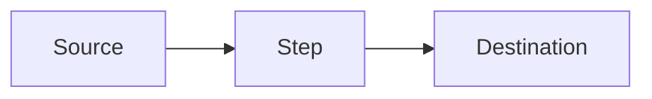

# CR#{N} — {Title}

> Replace `{placeholders}` and delete this blockquote before publishing.
> Sections marked **(optional)** may be removed if not applicable.
> Code references should use commit-pinned permalinks, not raw line numbers (they rot).

---

## Meta

| Field | Value |
|---|---|
| CR ID | CR#{N} |
| Title | {Title} |
| Status | Draft \| In Review \| Approved \| Implemented \| Rejected |
| Module | {module} |
| Owner | {name} |
| Sponsor | {name / business owner} |
| Created | {YYYY-MM-DD} |
| Target Release | {sprint / version / date} |
| Priority | High \| Medium \| Low |
| Source | {ticket / email / meeting} |

---

## Revision History

| Ver | Date | Author | Change |
|---|---|---|---|
| 0.1 | {YYYY-MM-DD} | {name} | Initial draft |

---

## Contents

1. [Requirement](#1-requirement)
2. [Current State](#2-current-state)
3. [Target State](#3-target-state)
4. [Assumptions](#4-assumptions)
5. [Out of Scope](#5-out-of-scope)
6. [Dependencies](#6-dependencies)
7. [Impact Analysis](#7-impact-analysis)
8. [Risks & Mitigation](#8-risks--mitigation)
9. [Proposed Solution](#9-proposed-solution)
10. [Rollout / Cutover Plan](#10-rollout--cutover-plan)
11. [Rollback Strategy](#11-rollback-strategy)
12. [Monitoring & Telemetry](#12-monitoring--telemetry)
13. [Security / Compliance](#13-security--compliance)
14. [Estimate](#14-estimate)
15. [Success Metrics](#15-success-metrics)
16. [Acceptance Criteria](#16-acceptance-criteria)
17. [Open Questions](#17-open-questions)
18. [Sign-off](#18-sign-off)
19. [References](#19-references)
20. [Glossary](#20-glossary)

---

## 1. Requirement

> One-paragraph statement of the requested change. Use business language.

{Describe what the user / sponsor is asking for and why.}

---

## 2. Current State

> Summarise existing behaviour. Include code references with commit SHA permalinks where possible.

**Pipeline / flow:**

**Key facts:**
- {fact 1}
- {fact 2}

**Code references** (commit `{sha}`):
- `path/to/file.cs` — `{symbol}` at line `{N}`

---

## 3. Target State

> Describe desired behaviour after the change. Mirror the structure of section 2.

- {target 1}
- {target 2}

---

## 4. Assumptions

> Things assumed true. If any turn out false, scope or estimate must be revisited.

- A1: {assumption}
- A2: {assumption}

---

## 5. Out of Scope

> Explicitly list things this CR will **not** do. Prevents scope creep.

- {item}
- {item}

---

## 6. Dependencies

| # | Depends On | Owner | ETA | Blocking? |
|---|---|---|---|---|
| D1 | {team / system / artefact} | {name} | {date} | Yes / No |

---

## 7. Impact Analysis

### 7.1 External Systems (DW / SAP / 3rd party)

| Item | Change |
|---|---|
| `{component}` | {change} |

### 7.2 Backend

| File | Change |
|---|---|
| `{path}` | {change} |

### 7.3 Frontend

| Area | Files | Change |
|---|---|---|
| {area} | `{path}` | {change} |

### 7.4 Database / Migration

| Object | Change | Backfill |
|---|---|---|
| `{table / column}` | {DDL} | {strategy} |

### 7.5 Operations / Infra (optional)

- {ops impact}

**File count summary:** BE = {n}, FE = {n}, SQL/migration = {n}.

---

## 8. Risks & Mitigation

| # | Risk | Likelihood | Impact | Severity | Mitigation | Owner |
|---|---|---|---|---|---|---|
| R1 | {risk} | High / Med / Low | High / Med / Low | High / Med / Low | {plan} | {name} |

> Severity = Likelihood × Impact. Flag anything **High × High** as a blocker.

---

## 9. Proposed Solution

### Approach

{One-paragraph summary of the chosen approach.}

### Steps

1. {step}
2. {step}

### Alternatives considered

| Option | Pros | Cons | Decision |
|---|---|---|---|
| {alt} | {pros} | {cons} | Reject / Accept |

---

## 10. Rollout / Cutover Plan

| # | Step | Owner | When | Verify |
|---|---|---|---|---|
| 1 | {action} | {name} | {time} | {check} |

- Feature flag: `{flag-name}` (default off → on at {time})
- Parallel-run window: {duration}
- Cutover date / time: {YYYY-MM-DD HH:mm tz}
- Maintenance window required: Yes / No — {duration}

---

## 11. Rollback Strategy

| Trigger | Action | Recoverable? |
|---|---|---|
| {symptom} | {steps to revert} | Yes / No |

- DB rollback script: `{path}` (or "irreversible — backup required")
- Snapshot / backup: {what, where, retention}
- Feature flag kill-switch: Yes / No

---

## 12. Monitoring & Telemetry

| Metric | Source | Threshold | Alert |
|---|---|---|---|
| {metric} | {dashboard / log} | {value} | {channel} |

- New dashboards: {link}
- New alerts: {channel}
- Log fields added: {list}

---

## 13. Security / Compliance

- PII / sensitive data touched: Yes / No — {what}
- Access control change: Yes / No — {roles affected}
- Audit log requirement: {yes / no — detail}
- Compliance regime: PDPA / GDPR / SOX / none
- Security review required: Yes / No — {reviewer}

---

## 14. Estimate

> Effort in man-days. Confidence `±%` reflects uncertainty.

### 14.1 Backend

| Task | Role | Effort | Confidence |
|---|---|---|---|
| {task} | BE-dev | {n} d | ±{p}% |
| **BE total** | | **~{n} d** | |

### 14.2 Frontend

| Task | Role | Effort | Confidence |
|---|---|---|---|
| {task} | FE-dev | {n} d | ±{p}% |
| **FE total** | | **~{n} d** | |

### 14.3 Code Review

| Task | Role | Effort |
|---|---|---|
| {task} | Reviewer | {n} d |
| **Review total** | | **~{n} d** |

### 14.4 QA

| Task | Role | Effort |
|---|---|---|
| {task} | QA | {n} d |
| **QA total** | | **~{n} d** |

### 14.5 SIT

| Task | Role | Effort |
|---|---|---|
| {task} | QA / Dev | {n} d |
| **SIT total** | | **~{n} d** |

### 14.6 UAT support

| Task | Role | Effort |
|---|---|---|
| {task} | Dev / BA | {n} d |
| **UAT total** | | **~{n} d** |

### 14.7 Summary

| Phase | Effort |
|---|---|
| BE | {n} d |
| FE | {n} d |
| Code Review | {n} d |
| QA | {n} d |
| SIT | {n} d |
| UAT | {n} d |
| **Total man-days** | **~{n} d** |
| **Calendar (parallel roles)** | **~{n} weeks** |

> Blockers / preconditions: {what could delay this}

---

## 15. Success Metrics

> How will success be measured after release?

| Metric | Baseline | Target | Measure When |
|---|---|---|---|
| {KPI} | {current} | {goal} | {timeframe} |

---

## 16. Acceptance Criteria

### Backend

- [ ] AC-BE-1: {criterion} — TC-{ID}
- [ ] AC-BE-2: {criterion} — TC-{ID}

### Frontend

- [ ] AC-FE-1: {criterion} — TC-{ID}
- [ ] AC-FE-2: {criterion} — TC-{ID}

### Data / Migration

- [ ] AC-DATA-1: {criterion} — TC-{ID}

---

## 17. Open Questions

| # | Category | Question | Owner | Due | Status |
|---|---|---|---|---|---|
| Q1 | Data | {question} | {name} | {date} | Open / Answered |
| Q2 | Business | {question} | {name} | {date} | Open / Answered |
| Q3 | Ops | {question} | {name} | {date} | Open / Answered |
| Q4 | UX | {question} | {name} | {date} | Open / Answered |

---

## 18. Sign-off

| Role | Name | Decision | Date |
|---|---|---|---|
| Business Owner | {name} | Approve / Reject | {date} |
| Tech Lead | {name} | Approve / Reject | {date} |
| QA Lead | {name} | Approve / Reject | {date} |
| PM | {name} | Approve / Reject | {date} |

---

## 19. References

- Jira / ticket: {link}
- Confluence: {link}
- Figma / design: {link}
- Related PR(s): {link}
- DW / external doc: {link}
- Previous CR: {link}

---

## 20. Glossary

| Term (EN) | Term (TH) | Definition |
|---|---|---|
| {term} | {คำไทย} | {definition} |
